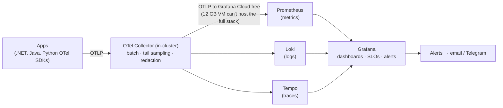

# Platform architecture

See [ecosystem-architecture.md](ecosystem-architecture.md) for the business systems. This document covers how they are built, shipped, run and observed.

## 1. Delivery pipeline (build → scan → sign → deploy)

```mermaid
flowchart LR
    DEV["git push / PR"] --> CI["App repo CI<br/>(calls reusable workflow)"]
    subgraph RW["reusable build-scan-sign workflow"]
      T["unit + integration tests"] --> SAST["CodeQL + gitleaks"]
      SAST --> B["docker buildx<br/>amd64 + arm64"]
      B --> TV["Trivy image scan<br/>fail on CRITICAL with fix"]
      TV --> SB["Syft SBOM (SPDX)"]
      SB --> SIGN["cosign sign<br/>(keyless, GitHub OIDC)"]
      SIGN --> PUSH["push to GHCR<br/>vX.Y.Z + sha"]
    end
    CI --> RW
    PUSH --> PR["bot PR to insurehub-platform:<br/>bump image tag"]
    PR -- "auto-merge on main for demo env" --> GIT[("insurehub-platform<br/>git")]
    GIT --> ARGO["ArgoCD"]
    ARGO --> K["k3s"]
    K --> KY["Kyverno admission:<br/>signed? limits? no :latest?"]
```



Branching: trunk-based with short-lived feature branches, Conventional Commits, PR required on `main`, CODEOWNERS, squash merge.

## 2. GitOps layout (app-of-apps)

```
clusters/demo/root-app.yaml          → watches clusters/demo/*
clusters/demo/infra/*.yaml           → cert-manager, postgres, rabbitmq, redis, keycloak   (sync-wave -2)
clusters/demo/observability/*.yaml   → otel-collector, prometheus, loki, tempo, grafana     (sync-wave -1)
clusters/demo/apps/*.yaml            → insurehub, integrations, claimguard, lendhub,
                                       insureassist, ussd                                   (sync-wave 0)
```

Each app Application points at the app repo's `deploy/` folder (kustomize) with an image tag overlay held in this repo, so app code and environment config are separated.

## 3. Cluster design (single node, demo)

| Concern | Choice |
|---|---|
| Distribution | k3s (lightweight, matches TelOne on-prem practice) |
| Ingress | Traefik (bundled) with middlewares: rate limit, security headers, redirect to HTTPS |
| TLS | cert-manager + Let's Encrypt HTTP-01; Cloudflare "Full (strict)" |
| Storage | local-path provisioner on the block volume |
| Namespaces | `infra`, `observability`, `insurehub`, `integrations`, `claimguard`, `lendhub`, `insureassist`, `ussd`, `argocd`, `keycloak` |
| Isolation | NetworkPolicies: default deny ingress per app namespace; allow from Traefik and declared dependencies only |
| Resources | every pod has requests/limits (Kyverno enforced); ResourceQuota per namespace |
| Databases | one PostgreSQL 16 StatefulSet, one database + role per system (P1: no shared schemas) |

## 4. Observability design



- **Golden signals** dashboard per service (rate, errors, duration, saturation).
- **Business dashboards:** payments per hour by status, reconciliation mismatches, claims by risk band, loans in arrears (PAR30), agent handoff rate.
- **Redaction:** the Collector strips `msisdn`, `nationalId` and message bodies from attributes before export.
- Trace ↔ log correlation via `traceId` in structured logs.

## 5. Environments

| Env | Where | Purpose |
|---|---|---|
| local | Docker Compose per repo; optional `k3d` cluster using the same manifests | development |
| demo | Oracle A1 k3s | public portfolio; resets nightly |
| production (paper only) | AKS, 3 nodes across zones, managed PostgreSQL, Azure Service Bus or RabbitMQ cluster | shows how the design scales; documented in ADR-0005 |

## 6. Production-scale target (paper design)

For interviews: how this becomes production for a real insurer.
- AKS with 3 node pools (system, apps, batch), zone-redundant; Azure Database for PostgreSQL Flexible Server (HA); RabbitMQ cluster (3 nodes, quorum queues) or Azure Service Bus.
- Azure Front Door + WAF; private endpoints; Key Vault via CSI driver; Entra ID for staff SSO.
- DR: secondary region with geo-restored DB, RPO 15 min / RTO 4 h.
- The same ArgoCD app-of-apps with an `clusters/prod` overlay.
