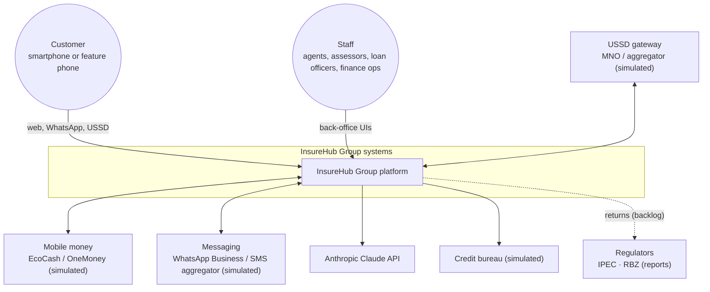

# InsureHub Group — ecosystem architecture

**Document type:** Architecture vision + integration catalogue
**Version:** 0.1 (2026-09-30) · **Owner:** Simbarashe Nyamusa (acting Enterprise/Solutions Architect)

> InsureHub Group is fictional: a Zimbabwean short-term and funeral insurer with a microfinance arm. Every repo in the portfolio is one system in its landscape.

---

## 1. Business context

InsureHub Group serves urban and peri-urban customers in Zimbabwe. Most customers pay by mobile money (EcoCash, OneMoney), many use feature phones, and almost all use WhatsApp. The group sells motor, funeral, home and (new) credit life cover, and lends to salaried workers and small traders through **InsureHub Microfinance**.

**Business drivers**

1. Collect premiums and loan repayments cheaply through mobile money.
2. Serve customers on the channels they already use: WhatsApp and USSD, not just the web.
3. Cut claims leakage from fraud without slowing honest claims.
4. Cross-sell: every loan carries credit life cover from the insurer.
5. Stay compliant with IPEC (insurance), RBZ (microfinance) and the Cyber and Data Protection Act [Chapter 12:07].

## 2. Architecture principles

| # | Principle | Implication |
|---|---|---|
| P1 | **Each system owns its data** | no shared database schemas; integrate via APIs and events |
| P2 | **Events for facts, APIs for questions** | state changes are published to `insurehub.events`; queries are synchronous REST |
| P3 | **At-least-once + idempotent** | every consumer is idempotent (inbox table); every payment call carries an idempotency key |
| P4 | **Right tool per job, few tools overall** | C# for core transactional systems, Java for the lending bank-style core, Python for AI/ML; one broker, one database engine |
| P5 | **Explainable automation** | AI proposes, rules decide, humans approve anything with money or fraud consequences |
| P6 | **Channel-agnostic core** | web, WhatsApp and USSD all call the same core APIs; no business rules in channels |
| P7 | **Secure by default** | TLS everywhere, signed webhooks, least-privilege roles, customer identity never taken from the model or the client |
| P8 | **Observable by default** | OpenTelemetry traces across HTTP and the bus; health probes; SLOs per service |
| P9 | **Everything as code** | infrastructure (Terraform), deployments (GitOps), dashboards and alerts in git |

## 3. System context (C4 level 1)

## 4. Containers (C4 level 2)

| Container | Repo | Stack | Owns (data) | Exposes |
|---|---|---|---|---|
| InsureHub web | `insurehub/frontend` | React 18 + TS (Vite) | — | public site, customer portal, back office |
| InsureHub API | `insurehub/backend` | ASP.NET Core 8, EF Core | customers, quotes, policies, premiums, claims | REST `/api/*`, events `ClaimLodged`, `PolicyIssued`, `PolicyLapsed` (planned) |
| Payments API | `insurehub-integrations` | .NET 8 minimal APIs | payments, idempotency keys, outbox, settlement | REST `/payments`, webhooks, events `PaymentSucceeded/Failed` |
| Notifications | `insurehub-integrations` | .NET 8 worker + API | delivery log, templates, inbox | consumes events; WhatsApp/SMS out |
| ClaimGuard | `claimguard` | Python FastAPI, scikit-learn | documents, extractions, scores, SIU decisions | UI + REST; consumes `ClaimLodged`, publishes `ClaimTriaged` (planned) |
| LendHub API | `lendhub` | Java 21, Spring Boot 3, Spring Modulith | borrowers, applications, loans, schedules, repayments, provisions | REST `/api/v1/*`; events `LoanDisbursed`, `InstalmentDue`, `LoanArrearsChanged` |
| LendHub web | `lendhub/web` | Angular | — | loan officer & manager back office |
| InsureAssist agent | `insureassist` | Python FastAPI, Anthropic SDK | conversations, handoffs, eval runs | WhatsApp webhook, web chat, staff inbox |
| MCP server | `insureassist/mcp_server` | Python MCP SDK | — (stateless) | MCP tools over the core APIs |
| USSD gateway | `insurehub-ussd` | .NET 8 minimal API, Redis | USSD sessions (ephemeral) | aggregator callback `/ussd`, phone simulator |
| Platform | `insurehub-platform` | Terraform, k3s, ArgoCD, OTel, Grafana | infra state, dashboards | — |
| Identity (phase 3) | `insurehub-platform` | Keycloak | staff identities, clients | OIDC |

## 5. Integration catalogue (synchronous)

| # | Consumer → Provider | Endpoint | Auth | Purpose |
|---|---|---|---|---|
| I1 | InsureHub → Payments | `POST /payments` (+`Idempotency-Key`) | service API key (phase 3: OAuth2 client credentials) | start premium collection |
| I2 | EcoCash (sim) → Payments | `POST /webhooks/ecocash` | HMAC-SHA256 `t=…,v1=…` | payment result |
| I3 | Payments → InsureHub | `POST /api/integrations/payments` | HMAC-signed callback | record premium, reinstate |
| I4 | Payments → LendHub | `POST /api/v1/integrations/payments` | HMAC-signed callback | record repayment (planned) |
| I5 | LendHub → InsureHub | `POST /api/partners/credit-life/policies` | client credentials | issue credit life policy on disbursement (planned) |
| I6 | LendHub → Credit bureau (sim) | `GET /reports/{nationalId}` | API key | credit check |
| I7 | MCP server → InsureHub / LendHub / Payments | read + selected write APIs | per-customer delegated token (see InsureAssist security doc) | agent tools |
| I8 | USSD gateway → InsureHub / LendHub / Payments | same APIs as web | service token + customer PIN session | feature-phone self-service |
| I9 | ClaimGuard → Claude API | Messages API (structured outputs) | API key | document extraction, briefs |
| I10 | InsureAssist → Claude API | Messages API (tool use) | API key | agent reasoning |

## 6. Event catalogue (asynchronous, RabbitMQ topic exchange `insurehub.events`)

Envelope (all events): `eventId` (UUID), `type`, `occurredAt` (UTC), `source`, `correlationId`, `traceparent` (header), `data`. Documented as AsyncAPI in `insurehub-integrations/docs/asyncapi.yaml` (planned).

| Event (routing key) | Producer | Consumers | Status |
|---|---|---|---|
| `payment.succeeded` | Payments | Notifications, merchant callback handler, LendHub (planned) | ✅ built |
| `payment.failed` | Payments | Notifications | ✅ built |
| `reconciliation.mismatch` | Payments | Notifications (ops alert) | ✅ built |
| `policy.issued` | InsureHub | Notifications | planned |
| `policy.lapsed` | InsureHub | Notifications, InsureAssist (proactive nudge) | planned |
| `claim.lodged` | InsureHub | ClaimGuard, Notifications | planned |
| `claim.triaged` | ClaimGuard | InsureHub | planned |
| `claim.status-changed` | InsureHub | Notifications | planned |
| `loan.disbursed` | LendHub | Notifications | planned |
| `loan.instalment-due` | LendHub (EOD batch) | Notifications | planned |
| `loan.arrears-changed` | LendHub (EOD batch) | Notifications, InsureAssist | planned |
| `conversation.handoff-requested` | InsureAssist | Notifications (staff alert) | planned |

Rules: consumers are idempotent on `eventId`; failed messages retry with backoff then go to `{queue}.dlq`; schemas evolve additively only (new optional fields), breaking changes get a new `type` version (`claim.lodged.v2`).

## 7. Data ownership and classification

| Data | Owner system | Classification | Notes |
|---|---|---|---|
| Customer identity (name, national ID, phone, address) | InsureHub (insurance) / LendHub (loans) | **Personal — confidential** | minimise copies; events carry IDs, not full profiles |
| Policies, premiums, claims | InsureHub | confidential | |
| Claim documents & photos | ClaimGuard (copy) / InsureHub (source) | confidential, may include special data (injuries) | retention 7 years after claim closure (illustrative) |
| Payments, settlement files | Payments | confidential, financial | |
| Loans, repayments, credit reports | LendHub | **confidential — financial**, credit data | bureau consent recorded per application |
| Conversations & transcripts | InsureAssist | confidential | redact national IDs and card-like numbers before storage and before sending to the LLM where possible |
| USSD sessions | USSD gateway | transient | Redis TTL 180 s, never logged with PIN |

Cross-cutting privacy controls: lawful basis + consent recorded; purpose limitation; data subject access/erasure procedure (runbook); breach notification procedure (runbook); processing of personal data by the LLM provider disclosed in the privacy notice.

## 8. Cross-cutting concerns

| Concern | Standard |
|---|---|
| API style | REST + JSON, OpenAPI 3 per service, RFC 7807 ProblemDetails for errors, `/v1` in new services |
| Idempotency | `Idempotency-Key` header on all money-moving POSTs |
| Time & money | UTC in storage, Africa/Harare in UI; money as decimal (C#) / `BigDecimal` (Java) / `Decimal` (Python) with explicit currency (`USD`, `ZWG`) — never floats |
| Currency | ISO 4217 `ZWG` for ZiG; exchange rates stored with source and date, never hard-coded |
| AuthN/Z | Today: per-app JWT. Phase 3: Keycloak OIDC for staff, OAuth2 client credentials between services |
| Observability | OTel SDK in every service; W3C `traceparent` across HTTP and AMQP; structured JSON logs with `traceId` |
| Health | `/health/live`, `/health/ready` (checks DB + broker) |
| Config | 12-factor env vars; secrets in k8s Secrets (SOPS-encrypted in git) |
| Versioning | SemVer images (`vX.Y.Z` + git SHA), Conventional Commits |

## 9. Port map (local development)

| Service | Port |
|---|---|
| InsureHub API / web | 5080 / 5173 |
| Payments API | 5100 |
| Notifications | 5200 |
| ClaimGuard | 8000 |
| LendHub API / web | 8080 / 4200 |
| InsureAssist (agent + web chat) | 8100 |
| MCP server (streamable HTTP) | 8101 |
| USSD gateway + simulator | 5300 |
| RabbitMQ / mgmt | 5672 / 15672 |
| PostgreSQL | 5432 |
| Redis | 6379 |
| Jaeger / Grafana | 16686 / 3000 |

## 10. Roadmap of the landscape

| Phase | Adds | Architecture capability demonstrated |
|---|---|---|
| Now | InsureHub, Integrations, ClaimGuard | modular monolith, event-driven integration, AI document processing |
| Oct 2026 | Platform phase 1–2, LendHub | GitOps, observability, Java modular monolith + batch |
| Nov 2026 | InsureAssist | agentic AI, MCP, AI safety & evals |
| Dec 2026 | USSD, Platform phase 3 (Keycloak, DevSecOps) | channel strategy, federated identity, supply-chain security |
| 2027 | backlog (broker portal, IFRS 17, field app, SAP) | analytics, mobile offline-first, ERP integration |

## 11. Key risks

| Risk | Impact | Mitigation |
|---|---|---|
| Free host capacity/limits change | demo offline | fallback mapping in `free-hosting-plan.md`; UptimeRobot alerts |
| LLM costs from public traffic | unexpected bill | offline mode default; daily budget; rate limits |
| Scope creep across 6+ repos | nothing finished | one active build at a time; "done" = deployed + documented + video |
| Contract drift between services | broken demos | AsyncAPI/OpenAPI in repo; contract tests in CI (Phase 2) |
