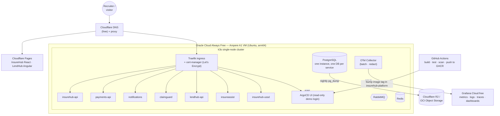

# Free hosting plan — deploy the ecosystem for $0/month

**Status:** ready to execute (Day 1: 2026-10-01)
**Owner:** Simbarashe Nyamusa

> Free tiers change often (Oracle halved its Arm allowance in June 2026). Before signing up, check each provider's current limits and terms. If a limit below turns out to be wrong, update this file and note the change in the decision log at the bottom. Limits were verified on 2026-09-30 — see [research-and-sources.md §6](research-and-sources.md).

---

## 1. Goals and constraints

| # | Requirement |
|---|---|
| G1 | Every project has a public URL a recruiter can open on a phone in under 10 seconds |
| G2 | Total cost: **$0/month** (a domain name, ~US$10/year, is the only optional cost) |
| G3 | Deployments are automated from GitHub (push to `main` → live) |
| G4 | The hosting setup is itself a portfolio piece: Kubernetes, GitOps, TLS, observability |
| G5 | No secrets in repos; AI API spend capped |
| G6 | Demo data resets nightly so strangers can't leave the demo broken |

## 2. Options compared

| Criterion | **A. Oracle Always Free VM + k3s** | **B. Managed free tiers (PaaS mix)** | C. Home server + Cloudflare Tunnel |
|---|---|---|---|
| Cost | $0 | $0 | $0 (+ electricity) |
| Shows Kubernetes / GitOps | ✅ strongly | ❌ | ✅ |
| Always on | ✅ | ⚠️ free web services sleep when idle (cold starts) | ⚠️ depends on ZESA/load-shedding and home internet |
| RAM for everything (≈10 services + Postgres + RabbitMQ) | ✅ **12 GB / 2 OCPU** on Arm A1 (halved from 24 GB in June 2026 — verified in Oracle docs, see sources) — enough if observability runs on Grafana Cloud | ⚠️ spread across many accounts, each with small limits | depends on hardware |
| Setup effort | medium (1 day) | low per service, but many dashboards | medium |
| Risks | card needed for sign-up; Arm capacity may be unavailable in some regions; **idle reclamation** if CPU p95, network *and* memory are all < 20% for 7 days (a full cluster stays above the memory threshold); Oracle changed the limits once already without notice | limits change; services sleep (Render: 15 min idle; free Postgres expires after 30 days) | power cuts in Harare |

**Decision:** Option A as the main host. Option B as a fallback for any piece that doesn't fit, and for frontends (Cloudflare Pages is simpler and faster for static SPAs). Option C is not used for the public demo. See ADR `adr/0001-hosting-oracle-always-free-k3s.md`.

## 3. Target deployment (Option A)

### Resource budget (single node, 12 GB RAM / 2 OCPU — the current Always Free A1 allowance)

| Component | Requests (RAM) | Notes |
|---|---|---|
| k3s system + Traefik + cert-manager | 1.0 GB | |
| ArgoCD (core install) | 0.8 GB | disable Dex and notifications controller |
| PostgreSQL 16 | 1.0 GB | one instance, databases: `insurehub`, `payments`, `notifications`, `claimguard`, `lendhub`, `insureassist` |
| RabbitMQ | 0.5 GB | management plugin on |
| Redis | 0.1 GB | USSD sessions, agent sessions |
| insurehub-api (.NET) | 0.3 GB | |
| payments-api, notifications (.NET) | 0.5 GB | |
| claimguard (Python) | 0.5 GB | scikit-learn + Pillow |
| lendhub-api (Java 21) | 0.8 GB | `-XX:MaxRAMPercentage=75`, consider CDS/AppCDS for startup |
| insureassist (Python) + MCP server | 0.5 GB | |
| insurehub-ussd (.NET) | 0.2 GB | |
| OTel Collector only | 0.2 GB | exports to **Grafana Cloud free** (10k metric series, 50 GB logs, 50 GB traces, 14-day retention) instead of running Prometheus/Loki/Tempo in-cluster (~3 GB saved) |
| **Total** | **≈ 6.5–7 GB** | leaves ~5 GB headroom on 12 GB for spikes, builds and the Java JIT |

**CPU is the tighter limit (2 OCPU).** Keep replicas at 1, set CPU requests low (50–100m) with limits, and schedule the LendHub end-of-day batch and reconciliation CronJobs at night so they don't compete with demo traffic.

If memory still runs short: move PostgreSQL to Neon free and Redis to Upstash free, or run the Payments/Notifications pair on one of the two free AMD micro VMs (1 GB each) — not recommended, since they are very small.

## 4. Public URLs (planned)

Assuming a domain such as `insurehub.dev` (placeholder — pick one you can buy, or use DuckDNS subdomains):

| URL | Service |
|---|---|
| `insurehub.<domain>` | InsureHub React app (Cloudflare Pages) |
| `api.insurehub.<domain>` | InsureHub API (Swagger at `/swagger`) |
| `pay.insurehub.<domain>` | Payments API |
| `notify.insurehub.<domain>` | Notifications (delivery log) |
| `claimguard.<domain>` | ClaimGuard |
| `lendhub.<domain>` / `api.lendhub.<domain>` | LendHub Angular / API |
| `assist.<domain>` | InsureAssist web chat simulator + staff inbox |
| `ussd.<domain>` | USSD phone simulator |
| Grafana Cloud public dashboard link | public read-only dashboards (linked from each README) |
| `argocd.<domain>` | ArgoCD (read-only demo account) |
| `status.<domain>` | UptimeRobot public status page |

## 5. Day 1 checklist (2026-10-01)

### Morning — accounts and cluster (≈3 h)
- [ ] Create accounts: Oracle Cloud (Always Free), Cloudflare, UptimeRobot, Grafana Cloud (backup plan), Neon (backup plan), CloudAMQP (backup plan)
- [ ] Buy or choose the domain; point nameservers to Cloudflare
- [ ] Create the A1 VM: Ubuntu 24.04 arm64, max free shape available, 100–200 GB boot volume (within free block storage)
- [ ] OCI networking: open 80/443 in the security list; restrict 22 to your IP; also open them in the VM's `iptables` (Oracle Ubuntu images block by default)
- [ ] SSH hardening: key-only login, `ufw`, `unattended-upgrades`, fail2ban
- [ ] Install k3s (keep bundled Traefik); copy kubeconfig to your laptop over SSH tunnel (don't expose 6443 publicly)
- [ ] Install cert-manager + a `ClusterIssuer` for Let's Encrypt (HTTP-01 via Traefik)
- [ ] Cloudflare DNS: A records → VM public IP (proxied, SSL mode "Full (strict)")

### Midday — first deploys (≈3 h)
- [ ] Housekeeping in each repo (see each repo's `NEXT_STEPS.md` → *Day 1 housekeeping*)
- [ ] CI builds **multi-arch images** (`linux/amd64,linux/arm64`) with `docker buildx` → GHCR (public packages)
- [ ] Deploy `insurehub-integrations` with its existing kustomize manifests (`deploy/k8s`) — it already has Postgres, RabbitMQ, probes, CronJob
- [ ] Deploy `insurehub-api` + InsureHub frontend to Cloudflare Pages (`VITE_API_URL` → `api.insurehub.<domain>`)
- [ ] Deploy `claimguard` in **offline mode** (no API key yet)
- [ ] Secrets: create with `kubectl create secret` for Day 1 → replace with SOPS/Sealed Secrets in Phase 2

### Afternoon — make it demo-ready (≈2 h)
- [ ] Nightly demo reset CronJob per app (drop & reseed demo DBs at 02:00 Africa/Harare)
- [ ] UptimeRobot monitors on every `/health/ready` + public status page
- [ ] Nightly `pg_dump` CronJob → R2 / OCI Object Storage bucket
- [ ] Update each README: live URL, CI badge, demo accounts
- [ ] Record the three Loom walkthroughs (scripts in each `NEXT_STEPS.md`)

## 6. Fallback mapping (Option B)

| Piece | If it doesn't fit on the VM |
|---|---|
| React / Angular SPAs | Cloudflare Pages (primary anyway), Vercel, Netlify |
| .NET / Java / Python APIs | Render free web service, Koyeb free instance, Azure Container Apps free monthly grant |
| PostgreSQL | Neon free, Supabase free |
| RabbitMQ | CloudAMQP free plan (note: low connection/message limits — keep consumers few) |
| Redis | Upstash free |
| Observability | Grafana Cloud free (OTLP endpoint) |
| Object storage | Cloudflare R2 free tier |

Cold-start mitigation on sleeping hosts: show a "waking up the demo…" message in the SPA and retry health checks. Don't use ping bots to defeat a provider's sleep policy if their terms forbid it.

## 7. Security rules for the public demo

- Demo accounts only; a banner on every app: *"Fictional demo — do not enter real personal data."*
- No real payment or messaging providers wired in public (simulated EcoCash/WhatsApp); sandbox keys only when showing a real adapter.
- AI features: `offline` by default; Claude mode behind a daily token budget (e.g. `AI_DAILY_TOKEN_BUDGET`), per-IP rate limit, and max upload size.
- Rate limiting at Traefik (middleware) for all public APIs.
- Secrets never in git: Day 1 `kubectl` secrets → Phase 2 SOPS (age key held offline) or Sealed Secrets.
- Images scanned (Trivy) in CI; fail on critical CVEs with a fix available.

## 8. Decision log

| Date | Decision | Why |
|---|---|---|
| 2026-09-30 | Option A (Oracle Always Free + k3s) primary, Option B fallback | shows k8s/GitOps skills; single place; $0 |
| 2026-09-30 | Frontends on Cloudflare Pages | global CDN, free, simple SPA hosting; keeps VM RAM for APIs |
| 2026-09-30 | Observability backend on Grafana Cloud free, not in-cluster | research showed the A1 allowance is now 12 GB / 2 OCPU, not 24 GB / 4 OCPU |

## 9. Sources

- [Oracle — Always Free resources (primary)](https://docs.oracle.com/en-us/iaas/Content/FreeTier/freetier_topic-Always_Free_Resources.htm)
- [Linuxiac — Oracle halves Always Free A1 (June 2026)](https://linuxiac.com/oracle-quietly-cuts-free-tier-ampere-a1-resources-in-half/)
- [Grafana Cloud pricing](https://grafana.com/pricing/)
- [Render — platforms with a real free tier in 2026](https://render.com/articles/platforms-with-a-real-free-tier-for-developers-in-2026)
- [Render free tier limits](https://agentdeals.dev/vendor/render)
- [DEV — best free tiers for developers 2026 (Neon)](https://dev.to/pickuma/best-free-tiers-for-developers-in-2026-saas-paas-iaas-tools-54og)
- [Layerbase — Upstash vs Redis Cloud free tiers](https://layerbase.com/blog/redis-free-tier-comparison)
- [CloudAMQP plans (not yet verified)](https://www.cloudamqp.com/plans.html)

Full research log: [research-and-sources.md](research-and-sources.md).
